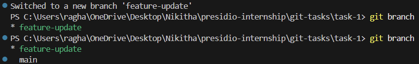
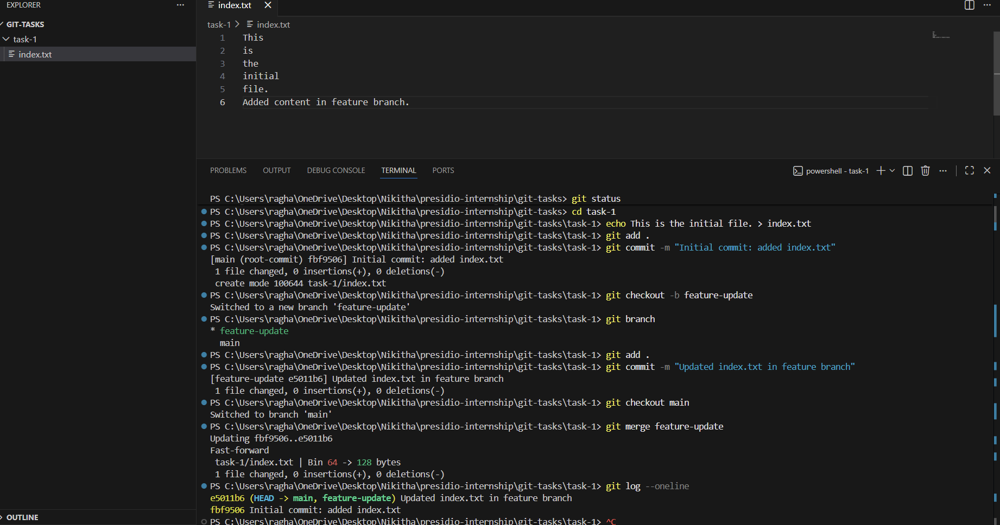

# Task 1: Initialize, Commit, and Branch Basics

## Objective
To demonstrate basic Git operations including repository initialization, committing changes, branching, and merging.

## Steps Performed

1. Initialized a Git repository using `git init`
2. Created a file (`index.txt`) and committed it
3. Created a new branch `feature-update`
4. Made changes to the file in the new branch and committed
5. Switched back to the main branch
6. Merged the feature branch into main
7. Verified commit history using `git log --oneline`

## Key Concepts Covered
- Git initialization
- Staging and committing changes
- Branch creation and switching
- Merging branches
- Viewing commit history

## Output

### Commit History

