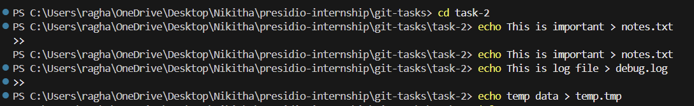
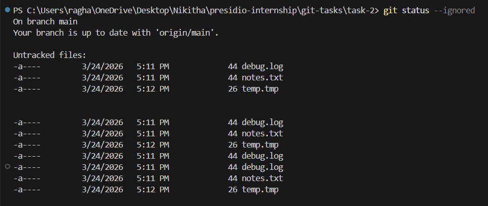

# Task 2: Using .gitignore and Tracking Files

## Objective
To configure a .gitignore file to exclude specific files and verify that Git correctly ignores them.

## Steps Performed

1. Created a new folder for the task
2. Added files:
   - notes.txt (important file)
   - debug.log (log file)
   - temp.tmp (temporary file)
3. Created a `.gitignore` file with the following patterns:
   - *.log
   - *.tmp
4. Verified file tracking using `git status` and `git status --ignored`

## Key Concepts Covered
- Ignoring files using .gitignore
- Pattern-based exclusion (*.log, *.tmp)
- Difference between tracked and untracked files
- Verifying ignored files using Git commands

## Output

### Git Status (Ignored Files)
- *.log
- *.tmp