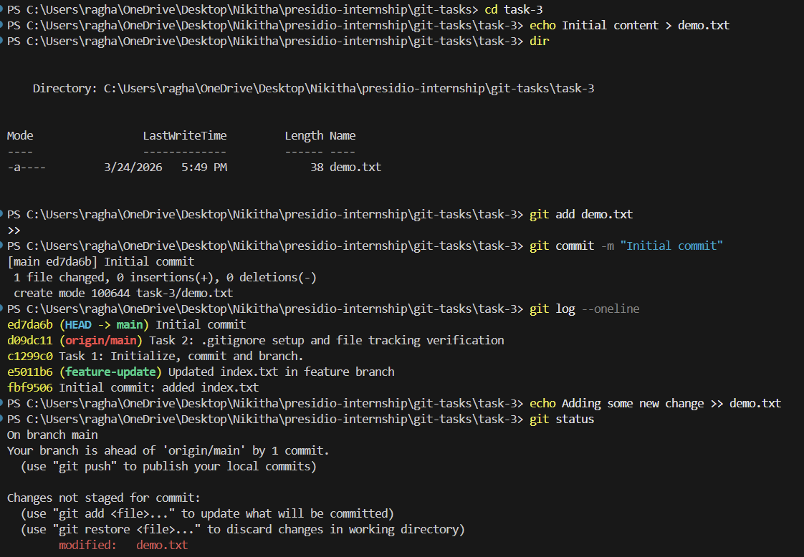
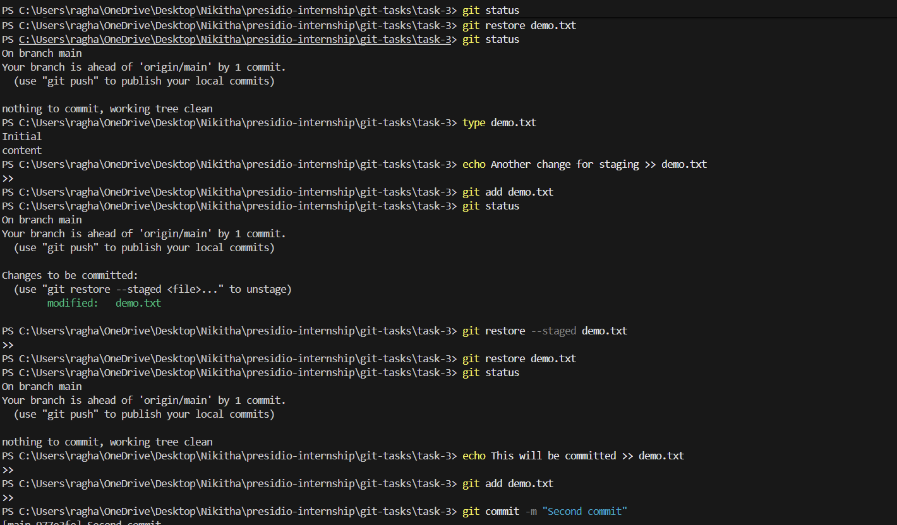
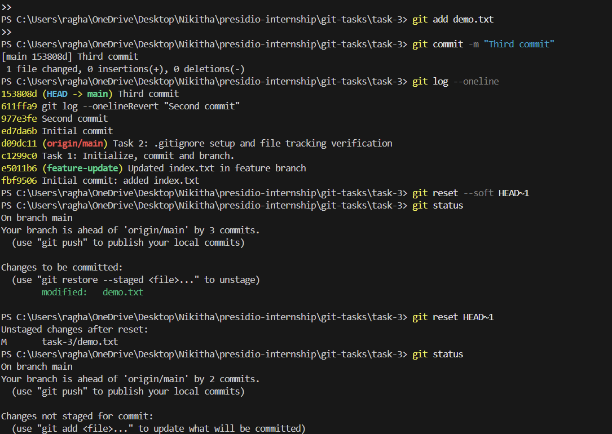
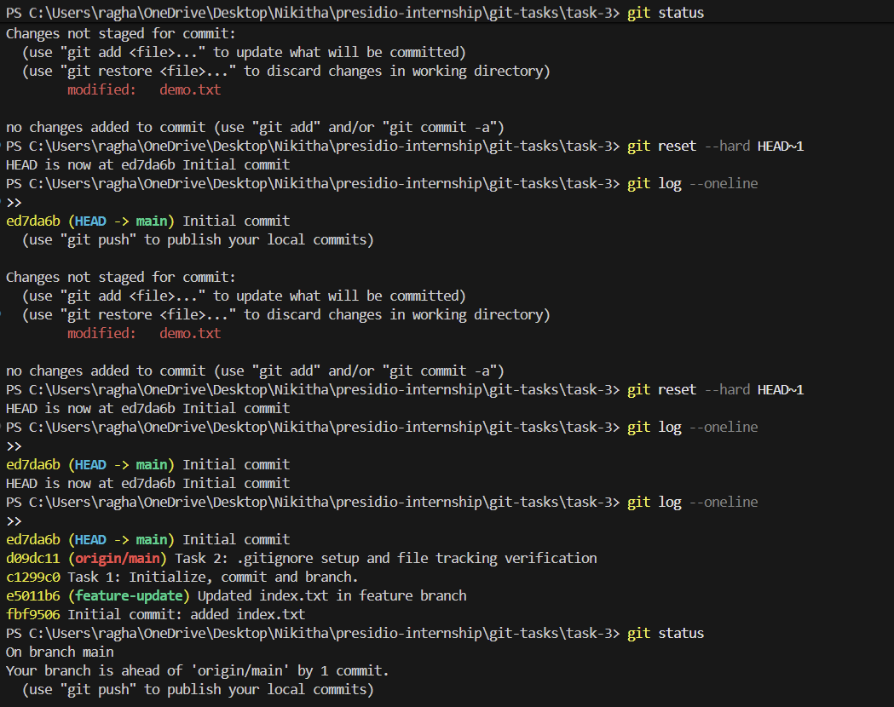

# Task 3: Undoing Changes and Reverting Commits

##  Objective

To explore different methods of undoing changes in Git at various stages, including:

* Working directory changes
* Staged changes
* Committed changes

---

##  Steps Performed

### 1. Initial Setup and First Commit

* Created a file `demo.txt`
* Added initial content
* Staged and committed the file

```bash
git add demo.txt
git commit -m "Initial commit"
```

✔ This created the base version of the file.

---

### 2. Undoing Changes in Working Directory

* Modified the file using:

```bash
echo Adding some new change >> demo.txt
```

* Checked status:

```bash
git status
```

 Git showed the file as **modified but not staged**

* Reverted changes using:

```bash
git restore demo.txt
```

✔ File returned to last committed state
✔ Working directory became clean

---

### 3. Undoing Staged Changes

* Modified and staged the file:

```bash
echo Another change for staging >> demo.txt
git add demo.txt
```

 Git showed the file under **“Changes to be committed”**

* Unstaged and removed changes:

```bash
git restore --staged demo.txt
git restore demo.txt
```

✔ First command removed file from staging
✔ Second command discarded changes completely

---

### 4. Creating a New Commit

```bash
echo This will be committed >> demo.txt
git add demo.txt
git commit -m "Second commit"
```

✔ A new commit was added to the history

---

### 5. Undoing Commit Using `git revert`

```bash
git revert HEAD
```

✔ A new commit was created that **reversed the previous commit**
✔ Original commit remained in history
✔ Safe for collaborative environments

---

### 6. Undoing Commit Using `git reset`

#### Soft Reset

```bash
git reset --soft HEAD~1
```

✔ Commit removed
✔ Changes moved to staging area

---

#### Mixed Reset

```bash
git reset HEAD~1
```

✔ Commit removed
✔ Changes moved to working directory (unstaged)

---

#### Hard Reset

```bash
git reset --hard HEAD~1
```

✔ Commit removed
✔ Changes permanently deleted
✔ Repository returned to previous clean state

---

##  Output Explanation

The terminal output demonstrates:

* `git status` showing transitions between:

  * modified → staged → clean
* `git log --oneline` showing:

  * initial commit
  * second commit
  * revert commit
  * removal of commits after reset
* After `git reset --hard`, only the **initial commit remains**, confirming that all later commits were removed

---

##  Key Differences

| Command                | Purpose           | Effect                       | Safety    |
| ---------------------- | ----------------- | ---------------------------- | --------- |
| `git restore`          | Undo file changes | Discards uncommitted changes | Safe      |
| `git restore --staged` | Unstage file      | Moves file out of staging    | Safe      |
| `git revert`           | Undo commit       | Adds new reversing commit    | Safe      |
| `git reset --soft`     | Undo commit       | Keeps changes staged         | Moderate  |
| `git reset`            | Undo commit       | Keeps changes unstaged       | Risky     |
| `git reset --hard`     | Undo everything   | Deletes commit + changes     | Dangerous |

---

##  What I Learned

* Git tracks changes across three levels:

  * Working directory
  * Staging area
  * Commit history
* Different commands are used depending on where changes exist
* `git revert` is the safest way to undo commits
* `git reset` is powerful but must be used carefully

---

## Output




## Conclusion

This task provided hands-on experience with undoing changes at different stages in Git. It highlights the importance of choosing the correct method based on the situation to maintain a clean and reliable version history.
