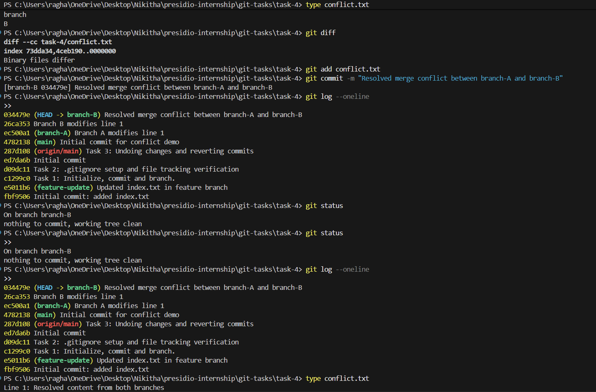

# Task 4: Simulating and Resolving Merge Conflicts

## Objective

The objective of this task is to understand how merge conflicts occur in Git and how to identify and resolve them manually using appropriate Git commands.

---

## Steps Performed

### 1. Initial Setup

A file named `conflict.txt` was created with initial content and committed to the repository.

```bash
git add conflict.txt
git commit -m "Initial commit for conflict demo"
```

This served as the common base for both branches.

---

### 2. Creating Branch A

A new branch `branch-A` was created from the main branch.

```bash
git checkout -b branch-A
```

The same line in `conflict.txt` was modified:

```bash
echo Line 1: Change from branch A > conflict.txt
```

The changes were staged and committed.

---

### 3. Creating Branch B

Switched back to the main branch and created another branch `branch-B`.

```bash
git checkout main
git checkout -b branch-B
```

The same line in `conflict.txt` was modified differently:

```bash
echo Line 1: Change from branch B > conflict.txt
```

The changes were staged and committed.

---

### 4. Creating the Merge Conflict

While on `branch-B`, an attempt was made to merge `branch-A`:

```bash
git merge branch-A
```

Git was unable to automatically merge the changes and reported a conflict.

---

### 5. Identifying the Conflict

The conflict was verified using:

```bash
git status
```

Git indicated that `conflict.txt` had been modified in both branches.

To inspect the conflict:

```bash
type conflict.txt
```

The file contained conflict markers:

```
<<<<<<< HEAD
Line 1: Change from branch B
=======
Line 1: Change from branch A
>>>>>>> branch-A
```

To further analyze differences:

```bash
git diff
```

---

### 6. Resolving the Conflict

The conflict was resolved manually by editing `conflict.txt` and replacing the conflicting section with a final resolved version:

```
Line 1: Resolved content from both branches
```

---

### 7. Completing the Merge

After resolving the conflict:

```bash
git add conflict.txt
git commit -m "Resolved merge conflict between branch-A and branch-B"
```

This completed the merge process.

---

## Output Explanation

The terminal output demonstrates the full lifecycle of a merge conflict:

* Both branches modify the same line in a file, causing a conflict
* Git marks the conflict using special indicators (`<<<<<<<`, `=======`, `>>>>>>>`)
* `git status` identifies the file as conflicted
* `git diff` shows the differences between the conflicting changes
* After manual resolution and commit, the repository returns to a clean state

The final commit history confirms that:

* Both branches were merged
* The conflict was resolved successfully
* The working directory is clean

---

## Key Concepts

* Branching and parallel development
* Merge conflicts and conflict markers
* Manual conflict resolution
* Use of `git status` and `git diff` for debugging

---

## What I Learned

This task provided practical insight into how merge conflicts occur when multiple branches modify the same part of a file. It also reinforced the importance of carefully reviewing conflicting changes and resolving them in a controlled and deliberate manner.

---

## Output


## Conclusion

Merge conflicts are a natural part of collaborative development. Understanding how to identify and resolve them ensures smoother integration of changes and helps maintain a stable and consistent codebase.
