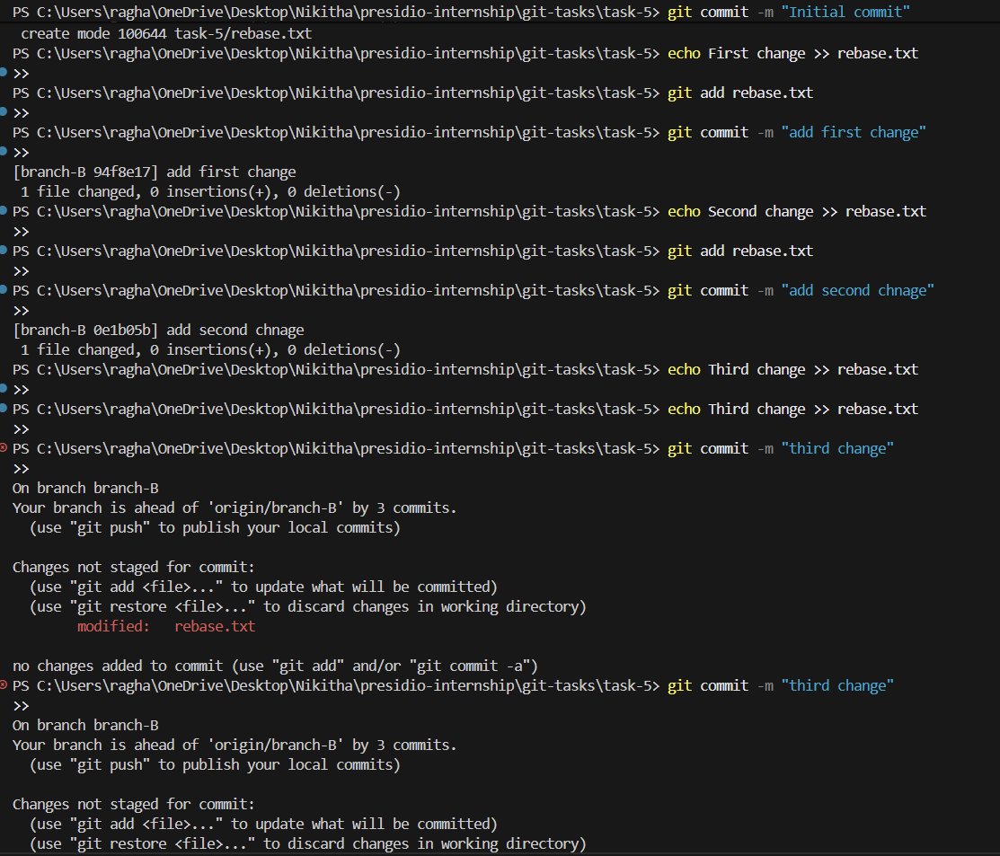
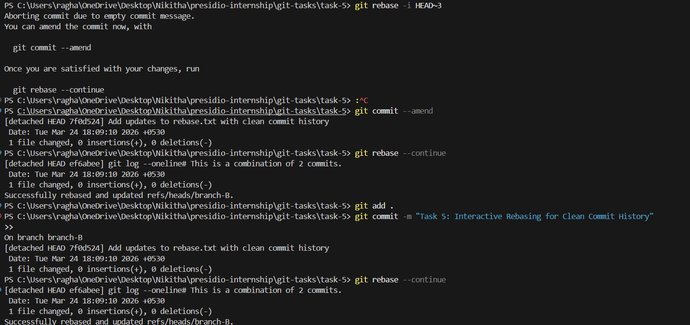

# Task 5: Interactive Rebasing for Clean Commit History

## Objective

The objective of this task is to understand how to use interactive rebasing in Git to clean up commit history by editing commit messages, squashing multiple commits, and improving overall readability before integrating changes into the main branch.

---

## Steps Performed

### 1. Initial Setup

A file named `rebase.txt` was created and committed to establish a base state.

```bash
git add rebase.txt
git commit -m "Initial commit"
```

---

### 2. Creating Multiple Commits

Several commits were intentionally created with minor changes and inconsistent commit messages to simulate a messy commit history.

```bash
echo First change >> rebase.txt
git add rebase.txt
git commit -m "add first change"

echo Second change >> rebase.txt
git add rebase.txt
git commit -m "add second chnage"

echo Third change >> rebase.txt
git add rebase.txt
git commit -m "fix stuff"
```

At this stage, the commit history contained:

* A typo in one commit message
* A vague commit message
* Multiple small commits that could be combined

---

### 3. Starting Interactive Rebase

Interactive rebase was initiated for the last three commits:

```bash
git rebase -i HEAD~3
```

This opened an editor showing the list of recent commits.

---

### 4. Modifying the Commit History

The rebase instructions were modified as follows:

* The first commit was kept as is
* The second commit message was corrected using `reword`
* The third commit was combined with the previous commit using `squash`

```
pick add first change
reword add second chnage
squash fix stuff
```

---

### 5. Editing Commit Messages

During the rebase process:

* The typo in "add second chnage" was corrected
* The squashed commits were combined into a single meaningful commit message:

```
Add updates to rebase.txt with clean commit history
```

---

### 6. Verifying Clean History

After completing the rebase:

```bash
git log --oneline
```

The commit history was simplified to:

* The initial commit
* A single clean, well-described commit

---

## Output Explanation

The terminal output demonstrates:

* The original commit history contained multiple small and inconsistent commits
* Interactive rebase allowed modification of commit order and messages
* Squashing combined multiple commits into one
* The final history is concise and easier to understand

---

## Key Concepts

* Interactive rebasing using `git rebase -i`
* Rewriting commit history
* Squashing commits
* Editing commit messages
* Maintaining clean and readable version history

---

## Why Squashing is Important

Squashing helps in combining multiple small or related commits into a single meaningful commit. This improves the clarity of the commit history and makes it easier for others to understand the changes made.

Before merging into the main branch, a clean commit history:

* Reduces noise from unnecessary commits
* Improves readability
* Makes code reviews more efficient

---

## What I Learned

This task demonstrated how to restructure commit history to make it more organized and professional. It highlighted the importance of writing clear commit messages and grouping related changes logically.

---

## Output



## Conclusion

Interactive rebasing is a powerful tool for maintaining a clean and structured commit history. When used appropriately, it helps present changes in a clear and meaningful way, especially before merging into the main branch.
