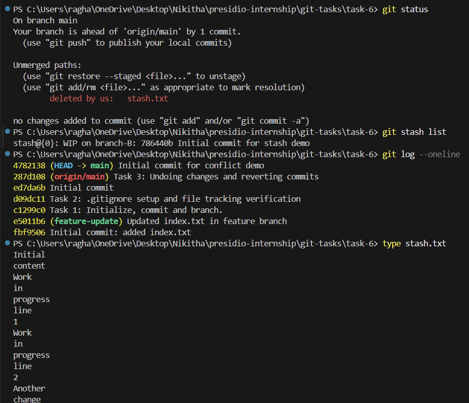

# Task 6: Stashing Changes for Context Switching

## Objective

The objective of this task is to understand how to use Git stash to temporarily save uncommitted changes, allowing context switching between branches without losing ongoing work.

---

## Steps Performed

### 1. Initial Setup

A file named `stash.txt` was created and committed to establish a base state.

```bash
git add stash.txt
git commit -m "Initial commit for stash demo"
```

---

### 2. Creating Uncommitted Changes

The file was modified without committing the changes.

```bash
echo Work in progress line 1 >> stash.txt
echo Work in progress line 2 >> stash.txt
```

Verification:

```bash
git status
```

Git showed the file as modified but not staged.

---

### 3. Stashing Changes

The uncommitted changes were temporarily saved using:

```bash
git stash
```

Verification:

```bash
git status
```

The working directory returned to a clean state.

To view stored stashes:

```bash
git stash list
```

---

### 4. Switching Branches

A new branch was created to simulate context switching.

```bash
git checkout -b temp-branch
```

Work was performed in this branch:

```bash
echo Temporary work in another branch > temp.txt
git add temp.txt
git commit -m "Work done in temp branch"
```

---

### 5. Reapplying Stashed Changes

Switched back to the main branch:

```bash
git checkout main
```

Reapplied the previously stashed changes:

```bash
git stash pop
```

Verification:

```bash
git status
type stash.txt
```

The changes were restored to the working directory.

---

### 6. Managing Stashes (Optional)

Created an additional stash:

```bash
echo Another change >> stash.txt
git stash
```

Viewed available stashes:

```bash
git stash list
```

Removed a stash entry:

```bash
git stash drop stash@{0}
```

---

## Output Explanation

The terminal output demonstrates:

* Uncommitted changes being temporarily stored using `git stash`
* A clean working directory after stashing
* Switching branches without affecting saved work
* Restoring changes using `git stash pop`
* Managing multiple stashes using `git stash list` and `git stash drop`

---

## Output SS


## Key Concepts

* Temporary storage of uncommitted changes
* Context switching between branches
* Stash management (`list`, `pop`, `drop`)
* Separation of working directory and commit history

---

## What I Learned

This task showed how to safely pause ongoing work without committing incomplete changes. It also demonstrated how Git stash helps in managing multiple tasks efficiently without losing progress.

---

## Conclusion

Git stash is a useful feature for handling interruptions during development. It allows developers to switch contexts quickly while preserving their work, improving workflow flexibility and productivity.
