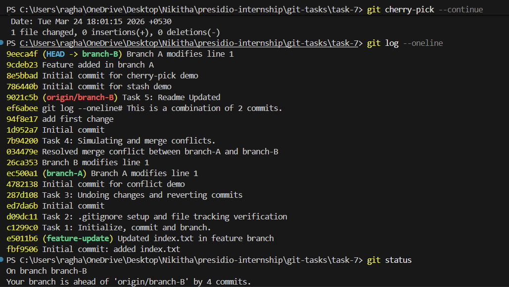

# Task 7: Cherry-Picking Commits Between Branches

## Objective

The objective of this task is to apply a specific commit from one branch to another using Git cherry-pick, without merging the entire branch.

---

## Steps Performed

### 1. Initial Setup

A base file was created and committed to the repository.

```bash
git add cherry.txt
git commit -m "Initial commit for cherry-pick demo"
```

---

### 2. Creating Branches

Two branches were created from the same base:

* `branch-A`
* `branch-B`

Each branch had its own changes committed independently.

---

### 3. Identifying the Commit

The commit from `branch-A` was identified using:

```bash
git log --oneline
```

The commit hash corresponding to the required change was selected.

---

### 4. Cherry-Picking the Commit

Switched to `branch-B` and applied the selected commit:

```bash
git checkout branch-B
git cherry-pick <commit-hash>
```

---

### 5. Resolving Conflicts

A conflict occurred during cherry-picking because the same file had been modified in both branches.

* The conflicted file was opened and reviewed
* Conflict markers were removed
* A final combined version of the content was written

```bash
git add <file>
git cherry-pick --continue
```

---

### 6. Verification

The commit history was checked:

```bash
git log --oneline
```

The cherry-picked commit was successfully added to `branch-B`.

The updated file content was verified to ensure changes from both branches were present.

---

## Output 


## Key Concepts

* Selective application of commits
* Difference between merge and cherry-pick
* Conflict resolution during cherry-pick
* Maintaining clean commit history

## Conclusion

Cherry-picking allows specific changes to be transferred between branches without merging all changes. This provides greater control over code integration and is useful when only certain commits are needed.
